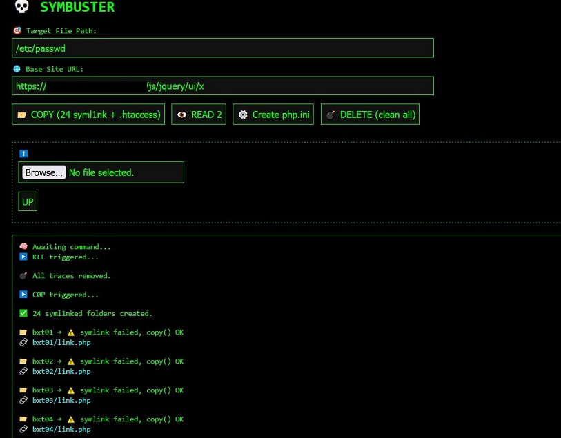

# 💀 SYMLINK BUSTER v4.3.2 – SHADOW LAYER

**A powerful symlink-based file access toolkit designed for penetration testing, file inspection, and LFI bypass techniques.**

> ⚠️ For educational and legal use only – do not use this tool on systems you do not own or manage.

---

## 🚀 Features

- 🔗 **Symlink creation + fallback clone system**  
- 📁 Auto-generates 24 folders with unique `.htaccess` MIME-type bypass variants  
- 🔬 **Multi-method scanner** – fget, fopen, include, filter, curl/proc_open, phar, and more  
- 🧠 Encrypted routing (ROT13 + HEX) to obfuscate critical commands and parameters  
- 🔄 Async scan engine – log response per-method and per-folder  
- ⚙️ PHP.ini injector for experimental override (optional)  
- 💣 Full cleanup system to remove all traces  
- 📤 Built-in file uploader (file.php, tools, etc.)

---

## 🛠️ Setup & Usage

1. Upload `symlinkbuster.php` to a server you **own** or **have explicit authorization** to test.  
2. Access it via browser: (https://yourdomain.com/symlinkbuster.php)

3. Fill out:
- 🎯 **Target File Path** (absolute path to the sensitive file)
- 🌐 **Base Site URL** (your current server’s URL)

4. Click:
- `📁 COPY`: Creates symlinks and injects `.htaccess` files for 24 test directories  
- `👁️ FULL SCAN`: Runs 10 access methods on each link to test visibility  
- `⚙️ Create php.ini`: Tries to override restricted directives  
- `💣 DELETE`: Cleans up everything created by the tool  
- `⬆️ Upload`: Upload custom files (optional shell/tools)

---

## 🔍 Access Methods

| Code     | Method                                      |
|----------|---------------------------------------------|
| `fget`   | `file_get_contents()`                       |
| `fop`    | `fopen()` + `stream_get_contents()`         |
| `rfile`  | `readfile()`                                |
| `inc`    | `include` via output buffering              |
| `filter1`| `php://filter` base64 encode + decode       |
| `filter2`| Double-layered `php://filter` trick         |
| `nullb`  | Null-byte injection (legacy exploit)        |
| `proco`  | Shell-level fetch via `proc_open` + curl    |
| `pharx`  | `phar://` wrapper (for crafted archives)    |
| `ctx`    | Stream context with custom header injection |

---

## 📄 Interface Overview

- **Input fields**:
- Target file path
- Base URL

- **Buttons**:
- 📁 COPY – Generate folders & symlinks
- 👁️ FULL SCAN – Run all detection methods
- ⚙️ Create php.ini – Attempt PHP directive override
- 💣 DELETE – Cleanup
- ⬆️ Upload – Send a file to the server

- **Logs**:
- All output is shown live below the controls

---

## 🧼 Cleanup

Clicking the `DELETE` button will:
- Remove all 24 folders (bxt01–bxt24)
- Delete `link.php` files and `.htaccess` rules
- Ensure no trace remains on the file system

---

## ⚠️ Legal Notice

SYMLINK BUSTER is a testing tool intended for **ethical hacking**, **red team operations**, and **security audits** under permission.  
**Do not use this script on unauthorized systems.**  
You are fully responsible for how you use this code.

---

## 📜 License

MIT License — free to use, modify, and distribute under ethical terms.

---

## 👑 Credits

Made with 💀 by [privdayz.com](https://privdayz.com)  
All trademarks, code patterns, and server configurations belong to their respective owners.
